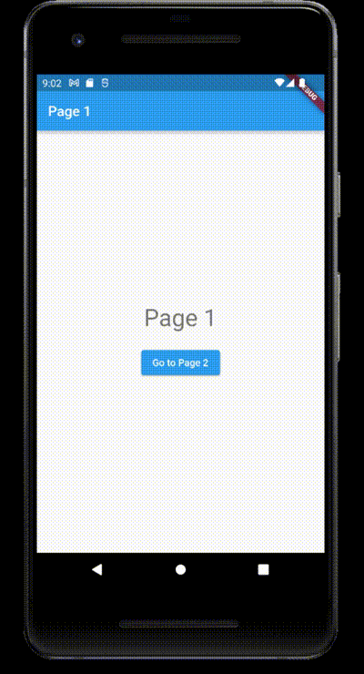

# GoRouter

[](https://pub.dev/packages/effective_dart) 
[](https://github.com/kodingworks/flutter-works-boilerplate)
[](https://github.com/felangel/bloc) 


[](https://github.com/hasanyatar)


 
## Table Of Content

- [Overview](#overview)
- [Getting Started](#getting-started)
  * [Requirement](#requirement)
  * [Setup](#setup)
- [GoRouter Navigation Settings](#gorouter-navigation-settings)
  * [Main configuration](#main-configuration)
- [GoRouter Navigation Settings](#gorouter-navigation-settings)
  * [Our main routing operations here](#our-main-routing-operations-here)
- [Navigation with Name or Path](#navigation-with-name-or-path)  
- [Routing Parameters](#routing-parameters)  
  * [Path variables parameters](#path-variables-parameters)
  * [Extra parameters](#extra-parameters)
- [Error handling](#error-handling) 
- [Listenable Refresh State](#listenable-refresh-state)   
- [Custom Loading Route Process](#custom-loading-route-process)  
---


## Overview
This repository is an Open-Source navigation declarative routing project intended for `GoRouter` on Flutter that really supports your productivity, with many features that we have prepared to speed up your work process.

## Getting Started

### Requirement

Here are some things you need to prepare before this Network-Manager setup:

1. Flutter SDK Stable (Latest Version) [Install](https://flutter.dev/docs/get-started/install)
2. Android Studio [Install](https://developer.android.com/studio)
3. Visual Studio Code (Optional) [Install](https://code.visualstudio.com/)

### Setup

To save your project based on this GoRouter, you need to do some of the steps you need to do. For a simple example of implementation

Here are the steps for setting up a Project with this GoRouter :

**Step 1:**

In this step you need to download (cloning) files from this repository to your local computer:

```bash
git clone https://github.com/hasanyatar/GoRouter.git
```

Or 

```bash
git clone git@github.com:hasanyatar/GoRouter.git
```

**Step 2:**

The next step is to open the folder that has been downloaded/cloned into a cli application such as `bash`, `cmd`, `terminal`. 

And then run this command to console:

```bash
flutter pub get
```

## GoRoute Configuration
### Main configuration
MaterialApp.router( ... ) Creates a MaterialApp that uses the Router instead of a Navigator.

Initializers to define our routes 

```dart
void main() {
  runApp(const MyApp());
}

class MyApp extends StatelessWidget {
  const MyApp({Key? key}) : super(key: key);

  @override
  Widget build(BuildContext context) {
    return  MaterialApp.router(
        routeInformationProvider: router.routeInformationProvider,
        routeInformationParser: router.routeInformationParser,
        routerDelegate: router.routerDelegate,
        title: 'Go Route example',
    );
  }
}
```
## GoRouter Navigation Settings
### Our main routing operations here.
As seen below, we initialize the initialLocation with "/", which is the home page's path.

We have routes that continue from homepage. These are page2, page3 and page4 . The root of these pages is "/".
So if you want to redirect to Page4 . "/page4" will be used
```dart

final router = GoRouter(
  initialLocation: '/', // * initial route path
  debugLogDiagnostics: true, // * enable debug log
  refreshListenable: AppState.instance, // * refresh when appState changes.

  redirect: (state) {
    final isLoggingIn = state.location == '/login';

    // * anywhere route the logout button is pressed, it will redirect to the login page
    if (!AppState.instance.isLoggedIn && !isLoggingIn) return '/login';

    //* if user is logged inside login page will be redirected to home page
    if (AppState.instance.isLoggedIn && isLoggingIn) return '/';

    return null;
  },

  routes: <GoRoute>[
    GoRoute(
        name: 'homePage',
        path: '/',
        builder: (BuildContext context, GoRouterState state) => const Page1(),
        routes: <GoRoute>[
          GoRoute(
            name: 'page2',
            path: 'page2/:text',
            builder: (BuildContext context, GoRouterState state) {
              return Page2(text: state.params['text']!);
            },
          ),
          //* page3 with Extra params
          GoRoute(
            name: 'page3',
            path: 'page3',
            builder: (BuildContext context, GoRouterState state) {
              final params = state.extra! as Map<String, Object>;
              final text = params['text'] as String;
              return Page3(text: text);
            },
          ),
          GoRoute(
            name: 'bottom_navigation_routers',
            path: 'page4',
            builder: (BuildContext context, GoRouterState state) {
              return const Page4();
            },
          ),
        ]),
    GoRoute(
      name: 'login',
      path: '/login',
      builder: (BuildContext context, GoRouterState state) => const LoginPage(),
    ),
    GoRoute(
      name: 'loading',
      path: '/loading',
      builder: (BuildContext context, GoRouterState state) => const LoadingPage(),
    ),
  ],
  errorBuilder: (context, state) => ErrorScreen(state.error!),
);

// * ERROR SCREEN
class ErrorScreen extends StatelessWidget {
  const ErrorScreen(this.error, {Key? key}) : super(key: key);
  final Exception error;

  @override
  Widget build(BuildContext context) => Scaffold(
        appBar: AppBar(title: const Text('My "Page Not Found" Screen')),
        body: ...
      );
}
```
## Navigation with Name or Path
#### We can navigation with path, on the other hand, we can also navigation by name.
```dart
   GoRoute(
      name: 'login',
      path: '/login',
      builder: (BuildContext context, GoRouterState state) => const LoginPage(),
    ),
```
#### To call with `name`
```dart
 GoRouter.of(context).pushNamed('login');
 ```
#### To call with `path`
 ```dart
 GoRouter.of(context).push('/login');
  ```
## Routing Parameters
### Path variables parameters
As seen below, path variable parameter is given with `:/text`

After that. The `text` should be pulled from the GoRouter state parameter. `state.params['text']`
 ```dart
 GoRoute(
      name: 'page2',
      path: 'page2/:text',
      builder: (BuildContext context, GoRouterState state) {
        return Page2(text: state.params['text']!);
      },
    ),
   ```
#### Use in navigation
```dart
 GoRouter.of(context).pushNamed('page2', params: {'text': text});
```
### Extra parameters 
The `state.extra` should be pulled from the GoRouter state parameter

The real meaning of extra parameter is we can give more than one parameter in map

❗ Important : Here we don't give parameters in path like path variables
 ```dart
 //* page3 with Extra params
GoRoute(
  name: 'page3',
  path: 'page3',
  builder: (BuildContext context, GoRouterState state) {
    final params = state.extra! as Map<String, Object>;
    final text = params['text'] as String;
    return Page3(text: text);
  },
)
```
#### Use in navigation
```dart
GoRouter.of(context).push('/page3', extra: {'text': text});
```
## Error handling
Error handling to be used in a wrong redirection in the navigation process

```dart
final router = GoRouter(
  ...
  errorBuilder: (context, state) => ErrorScreen(state.error!),
)
  
```
Error Screen
```dart
// * ERROR SCREEN
class ErrorScreen extends StatelessWidget {
  const ErrorScreen(this.error, {Key? key}) : super(key: key);
  final Exception error;

  @override
  Widget build(BuildContext context) => Scaffold(
        appBar: AppBar(title: const Text('My "Page Not Found" Screen')),
        body: ...
      );
}
```
## Listenable Refresh State 
### Listenable Refresh State for State Management in Routing
AppState, which I use within the entire application and check the login status
```dart
class AppState extends ChangeNotifier {
  static final AppState _instance = AppState._internal();
  static AppState get instance => _instance;
  AppState._internal();
  bool _loggedIn = true;
  bool get isLoggedIn => _loggedIn;
  final loginInfo = const LoginPage();

  void setLoggedIn(bool loggedIn) {
    _loggedIn = loggedIn;
    notifyListeners();
  }
}
```
We are defining `refreshListenable` in GoRouter
```dart
final router = GoRouter(
  ...
  refreshListenable: AppState.instance, // * refresh when appState changes.
)
```
### Redirect
The page to be redirected if the conditions are met on any page change.

When any navigation is made in this section, it drops here and makes sudden orientation according to certain conditions.
```dart
final router = GoRouter(
  ...
  redirect: (state) {
    final isLoggingIn = state.location == '/login';

    // * anywhere route the logout button is pressed, it will redirect to the login page
    if (!AppState.instance.isLoggedIn && !isLoggingIn) return '/login';

    //* if user is logged inside login page will be redirected to home page
    if (AppState.instance.isLoggedIn && isLoggingIn) return '/';

    return null;
  },
)
```
#### For example
As seen below, when logout is made, any navigation will be logout on the `redirect` side due to this changed state.
```dart
ElevatedButton(
  onPressed: () {
    // * when token is expired or user logged out
    context.read<AppState>().setLoggedIn(false);
  },
  child: const Text('Logout'),
),
```
## Custom Loading Route Process
### Custom GoRouter extension
#### I defined my own custom GoRouter extension
```dart
extension GoRouterLoading on GoRouter {
  void loadingStart() {
    push('/loading');
  }

  void loadingFinish() {
    if (canPop()) {
      if (location == '/loading') pop();
    }
  }
}
```
#### Usage
```dart
GoRouter.of(context).loadingStart();
await FakeService.fakeServiceCall().then((value) {
  GoRouter.of(context).loadingFinish();
  GoRouter.of(context).pushNamed('page2', params: {'text': text});
});
```
#### Loading gif


